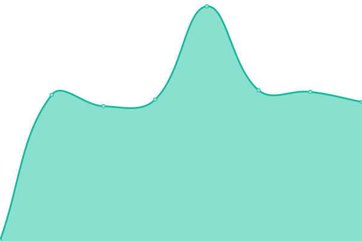
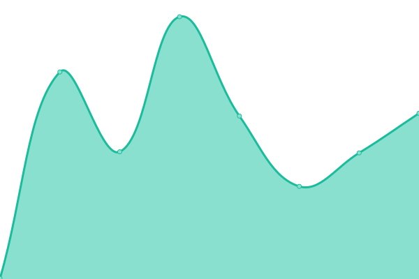

# [📈 Live Status](https://demo.upptime.js.org): <!--live status--> **🟧 Partial outage**

This repository contains the open-source uptime monitor and status page for [Javad Adib](https://MrAdib.com), powered by [Upptime](https://github.com/upptime/upptime).

With [Upptime](https://upptime.js.org), you can get your own unlimited and free uptime monitor and status page, powered entirely by a GitHub repository. We use [Issues](https://github.com/MrJavadAdib/upptime/issues) as incident reports, [Actions](https://github.com/MrJavadAdib/upptime/actions) as uptime monitors, and [Pages](https://demo.upptime.js.org) for the status page.

<!--start: status pages-->
<!-- This summary is generated by Upptime (https://github.com/upptime/upptime) -->
<!-- Do not edit this manually, your changes will be overwritten -->
<!-- prettier-ignore -->
| URL | Status | History | Response Time | Uptime |
| --- | ------ | ------- | ------------- | ------ |
|  [Jibres.com](https://jibres.com) | 🟩 Up | [jibres-com.yml](https://github.com/MrJavadAdib/upptime/commits/HEAD/history/jibres-com.yml) | 

 921ms
     
 | 

<a href="https://demo.upptime.js.org/history/jibres-com">100.00%</a>
    

|  [Jibres.ir](https://jibres.ir) | 🟩 Up | [jibres-ir.yml](https://github.com/MrJavadAdib/upptime/commits/HEAD/history/jibres-ir.yml) | 

 1552ms
     
 | 

<a href="https://demo.upptime.js.org/history/jibres-ir">100.00%</a>
    

|  [Talambar.ir](https://talambar.ir) | 🟩 Up | [talambar-ir.yml](https://github.com/MrJavadAdib/upptime/commits/HEAD/history/talambar-ir.yml) | 

 959ms
     
 | 

<a href="https://demo.upptime.js.org/history/talambar-ir">100.00%</a>
    

|  [Talambar.com](https://talambar.com) | 🟩 Up | [talambar-com.yml](https://github.com/MrJavadAdib/upptime/commits/HEAD/history/talambar-com.yml) | 

 753ms
     
 | 

<a href="https://demo.upptime.js.org/history/talambar-com">100.00%</a>
    

|  [CDN Talambar.com](https://cdn.talambar.com) | 🟥 Down | [cdn-talambar-com.yml](https://github.com/MrJavadAdib/upptime/commits/HEAD/history/cdn-talambar-com.yml) | 

 0ms
     
 | 

<a href="https://demo.upptime.js.org/history/cdn-talambar-com">100.00%</a>
    

|  [CDN Talambar.ir](https://cdn.talambar.ir) | 🟥 Down | [cdn-talambar-ir.yml](https://github.com/MrJavadAdib/upptime/commits/HEAD/history/cdn-talambar-ir.yml) | 

 890ms
     
 | 

<a href="https://demo.upptime.js.org/history/cdn-talambar-ir">0.00%</a>
    

|  [Cloud Talambar.com](https://cloud.talambar.com) | 🟩 Up | [cloud-talambar-com.yml](https://github.com/MrJavadAdib/upptime/commits/HEAD/history/cloud-talambar-com.yml) | 

 725ms
     
 | 

<a href="https://demo.upptime.js.org/history/cloud-talambar-com">100.00%</a>
    

|  [Cloud Talambar.ir](https://cloud.talambar.ir) | 🟩 Up | [cloud-talambar-ir.yml](https://github.com/MrJavadAdib/upptime/commits/HEAD/history/cloud-talambar-ir.yml) | 

 854ms
     
 | 

<a href="https://demo.upptime.js.org/history/cloud-talambar-ir">100.00%</a>
    

|  [Wikipedia](https://en.wikipedia.org) | 🟩 Up | [wikipedia.yml](https://github.com/MrJavadAdib/upptime/commits/HEAD/history/wikipedia.yml) | 

 263ms
     
 | 

<a href="https://demo.upptime.js.org/history/wikipedia">100.00%</a>
    

|  [Test for HEAD](https://www.google.com) | 🟩 Up | [test-for-head.yml](https://github.com/MrJavadAdib/upptime/commits/HEAD/history/test-for-head.yml) | 

 33ms
     
 | 

<a href="https://demo.upptime.js.org/history/test-for-head">100.00%</a>
    

<!--end: status pages-->

[**Visit our status website →**](https://demo.upptime.js.org)

## 📄 License

- Powered by: [Upptime](https://github.com/upptime/upptime)
- Code: [MIT](./LICENSE) © [Javad Adib](https://MrAdib.com)
- Data in the `./history` directory: [Open Database License](https://opendatacommons.org/licenses/odbl/1-0/)
